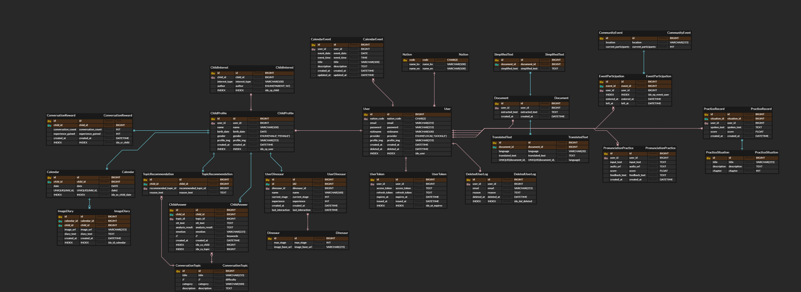

# 📑 다온
**AI 기반 다문화 가정 통합 지원 플랫폼**

> 다온은 다문화 가정이 언어·문화적 장벽을 넘어 원활하게 소통하고 지역사회와 연결될 수 있도록 돕는 AI 기반 지원 플랫폼입니다.

---

## 🚀 서비스 개요

### 📌 개발 동기
- **언어 장벽** : 다문화 가정 아동은 부모와의 의사소통, 학교생활, 지역사회 적응에 어려움이 있음  
- **교육 격차** : 한국어 발음 및 문서 이해 부족으로 학습에서 소외되기 쉬움  
- **지역사회 단절** : 주변 이주민들과 연결할 수 있는 커뮤니티 부족  

### 🎯 개발 목표
- **발음 평가 및 학습 지원** : AI 기반 음성 인식 + 발음 평가로 아동의 언어 학습 지원  
- **문서 인식 및 번역** : OCR·문서 분석 AI로 공공문서나 안내문을 쉽고 빠르게 이해  
- **커뮤니티 연결** : 같은 지역 이주민들이 소통할 수 있는 커뮤니티 제공  
- **종합 지원 플랫폼** : 다문화 가정이 학습·생활·교류를 한 곳에서 해결  

---

## 🔎 필요성
- 한국 내 다문화 가정 수 증가 → 교육·생활 지원 수요 확대  
- 다문화 가정 내의 아이와의 소통 단절 문제가 대두됨
- 기존 공공 서비스(예 : 다누리)는 제한적 기능 (정보 제공 위주)  
- AI 기술을 통한 발음 교정·문서 자동 해석·맞춤형 학습 서비스 제공 가능  
- 실시간 지원과 지역 기반 커뮤니티 결합의 필요성 대두  

---

## 🌟 차별점 & 개선점
- **펭구와의 대화 기능** : 아이 대화 요약 + 감정 분석 + 그림일기 제공 → 부모는 아이의 생각과 감정을 쉽게 이해    
- **실시간 문서 분석** : OCR & LLM 기반 쉬운 한국말 요약 및 모국어 번역 
- **커뮤니티 기능 강화** : 동네 이주민 소통으로 외로움 해소
- **상황별 한국어 학습 제공**  :  일상 생활에 대한 한국어 학습 가능
- **AI 기반 한국어 발음 평가 제공** (STT + G2P + 자모 분해 + 가중 레벤슈타인) 
---

# 🎨 프로젝트 설계

## 1. 시스템 아키텍처

## 2. ERD

---

## ⚙️ 기술 스택

| 분류         | 기술                                                                          |
|--------------|-----------------------------------------------------------------------------|
| **AI**       | Hugging Face Wav2Vec2, Whisper 1, gpt 4o mini tts, dalle, gpt 4.1, tesseract |
| **Backend**  | Spring Boot, JPA, MySQL, Redis, AWS S3/EC2/RDS                              |
| **Frontend** | Vue.js, TailwindCSS, Vite                                                   |
| **Infra**    | Nginx, Docker, GitLab CI/CD                                                 |

---

# 🎬 주요 기능

### 1. 펭구와의 대화 & 감정 분석
- **펭구(가상 친구)** 와 아이가 자유롭게 대화  
- 대화 내용을 **AI가 요약**하고 **감정 분석** 수행  
- 결과를 기반으로 **그림일기** 자동 생성  
→ 부모는 한국어가 서툴러도 아이의 생각·감정을 쉽게 이해     
→ 아이와 **마음의 거리**를 좁힐 수 있음

### 2. 문서 분석
- **OCR + LLM**를 활용하여 공공문서나 안내문 실시간 쉬운 한국말 요약 및 모국어 번역 

### 3. 커뮤니티
- 지역 기반 게시판 → 같은 동네 이주민과 소통  
- 관심사 공유 및 자녀 양육 경험 교류로 외로움 해소

### 4. 상황별 학습
- 병원·관공서·은행 등 실제 생활 시나리오 기반 학습  
- 발음 평가와 연계하여 자연스러운 학습 경험 제공  

### 5. 한국어 발음 평가
- **과정**: 음성 입력 → STT(Wav2Vec2) → G2P 변환 → 자모 분해 → 유사도 계산 → 0~100점 점수화  
- **특징**: 실시간 피드백 제공, 학습 동기 강화

---

# 🦉 Team

| 이름   | 역할                  | 주요 업무                                                                                                                      |
|--------|---------------------|----------------------------------------------------------------------------------------------------------------------------|
| 김호정  | 팀장, Backend, AI     | ERD 설계, 아이 발화 요약 및 그림일기 생성 API 개발, Whisper + gpt 4o mini tts 적용, 한국어 발음 평가 FastAPI 개발, AWS S3 업로드 로직 구현, 일정 생성 CRUD API 개발 |
| 김현재  | Frontend, Backend, Infra | Widget, Button, Icon Component 개발, 백엔드 아이 프로필 CRUD, OCR 개발, AWS S3 연결, EC2 환경설정, 영상 포트폴리오 제작                               |
| 류지선  | Frontend, Backend   | 와이어프레임 설계, UI 컴포넌트 개발 (layout / form / navigation / widget), 커뮤니티·채팅 기능 구현, WebSocket 기반 실시간 채팅, 한글 IME 입력 시 전송 안정화                          |
| 임유나  | Frontend, Design    | 와이어프레임, 목업, 프로토타입 제작, 디자인-개발 간 일관성 유지 및 품질 관리, 웹 애플리케이션 사용자 인터페이스 개발, API 연동 및 데이터 바인딩                                     |
| 장민석  | Backend, AI         | 아이와 대화 진행 AI, AI 캐릭터 성장 시스템, 대화 내용에서 관심사 키워드 추출 및 추천, 로그인/회원가입                                                             |
| 장준우  | Backend, Infra      | 애플리케이션 인프라 담당, 배포 환경 구성, CI/CD 자동화 구축, 학습 기능 백엔드 개발                                                                        |

---

# 🌐 배포 링크
- [다온 서비스 접속하기](https://i13a706.p.ssafy.io/)
- [다온 영상 포트폴리오 바로가기](https://youtu.be/5iCgdnhOeOo?si=h4KwZmA3y50D9ZLs)