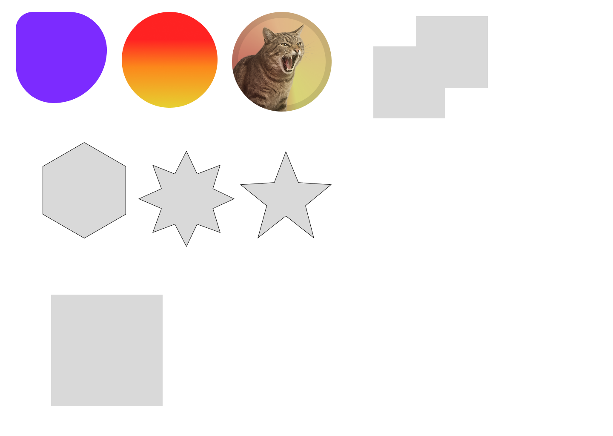

# Figma 학습

## 학습 책:


### UX/UI 디자이너를 위한 실무 피그마

## 현재 학습 진도:

- ## 95p
- Chapter1 피그마 시작하기
  - 피그마 인터페이스 살펴보기
- Chapter2 그래픽 스타일과 라이브러리
  - Lesson1 그래픽 스타일과 벡터 中

### Figma ai 프롬프트를 활용한 디자인 시안 작성해보기


### Lesson1 그래픽 스타일과 벡터



---
---

# JavaScript 기초부터 다시 학습

## 학습 사이트:


[노마드코더](https://nomadcoders.co/)

## 수강 중인 강의:


### [ES6의 정석](https://nomadcoders.co/es6-once-and-for-all)

## 현재 수강 진도(6강)

- **#6 Rest and Spread**
  - Introduction to Spread
  - Spread Applications
  - Intro to Rest Parameters
  - Rest + Spread + Destructure Magic

---

### Spread

- Spread 구문을 사용하면 배열, 문자열, 객체 등 반복 가능한 객체 (Iterable Object)를 개별 요소로 분리할 수 있음

```js
const arr1 = [0, 1, 2];
const arr2 = [3, 4, 5];

// arr1 은 이제 [0, 1, 2, 3, 4, 5]
arr1 = [...arr1, ...arr2];

// [array(1), array(2)]
console.log(arr1, arr2);

// [0, 1, 2, 3, 4, 5]
console.log(...arr1, ...arr2);
```

- 값을 추가하거나 할 때에는 새로운 배열을 만들어서 spread를 통해 기존의 값을 가져오고 추가할 값을 함께 넣어줌

```js
// 배열일 때)
const friends = ["nico", "lynn"];

const newFriends = [...friends, "joey"];

// ["nico", "lynn", "joey"]
console.log(newFriends);

// object 일 때)
const objectnico = {
  username: "nico",
};

// 중괄호로 감싸는 이유는 object 니까!
// {username: "nico", password: 123 }
console.log({ ...objectnico, password: 123 });

const first = ["mon", "tue", "wed"];

const weekend = ["sat", "sun"];

const fullweek = [...first, "thu", "fri", ...weekend];

// ["mon", "tue", "wed", "thu", "fri", "sat", "sun"]
console.log(fullweek);
```

- 조건부로 object에 값을 추가하고 싶을 때

```js
// last name을 뭐로 할 지 입력을 받아옴
const lastName = prompt("Last name : ");

const user = {
  username: "nico",
  age: 24,
  // 이 경우 조건에 해당하지 않는 경우에도 값이 추가됨.
  // lastName: lastName !== "" ? lastName : undefined,

  // 이 경우 조건에 해당할 때만 값이 추가되고 아니라면 그냥 username, age만 가지는 object가 반환됨.
  ...(lastName !== "" && { lastName }),
};

console.log(user);
```

### rest

- Spread : 확장 / Rest : 축소

- 둘 다 변수 앞에 ... 를 붙이며,
  parameter 부분에 들어가게 되면 rest(대체로)라고 부름.
- Rest는 Array 를 만든다.

```js
const infiniteArgs = (...kimchi) => console.log(kimchi);

// ["1", 2, true, "lalala"]
infiniteArgs("1", 2, true, "lalala");

const bestFriendMaker = (firstone, ...rest) =>
  console.log(`mybestfriend is ${firstone}`);

// mybestfriend is nico
bestFriendMaker("nico", "lynn", "dall");
```

- 특정 속성을 없앨 때

```js
const user = {
  name: "nico",
  age: 24,
  password: 12345,
};

user["password"] = null;

// 단순히 null로 값을 바꾼거지 속성 자체를 지우진 못한다.
//  {name: "nico", age: 24, password: null}
console.log(user);

const killage = ({ age, ...rest }) => rest;

const cleanuser = killage(user);

// {name: "nico", age: 24}
console.log(cleanuser);
```

- 특정 값만 기본값을 지정해줄 때

```js
const user = {
  name: "nico",
  age: 24,
  password: 12345,
};
// 구조 분해를 통해 나누어 줌
const setCountry = ({ country = "KR", ...rest }) => ({ country, ...rest });

// country만 기본 값에 따라 나옴
// {name: "nico", age: 24, country: "KR"}
console.log(setCountry(user));
```

- 특정 값의 속성 명을 변경할 때

```js
//
const rename = ({ name: newname, ...rest }) => ({ newname, ...rest });

// {newname: "nico", age: 24, password: 12345}
console.log(rename(user));
```
