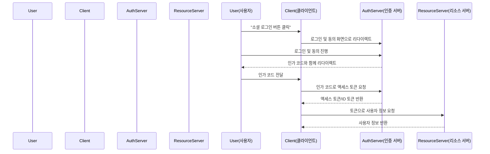

## 금일 목표

- OAuth2 기본 개념 학습
- Spring Security에서 OAuth2 Client 구조 이해
- 구글, 카카오, 네이버 소셜 로그인 실습 준비 
---

## OAuth2 기본 개념 학습

### OAuth2란?

- **OAuth2**는 사용자의 인증 정보를 직접 노출하지 않고, 제3자 애플리케이션이 제한된 접근 권한을 위임받을 수 있도록 해주는 인증/인가 표준 프로토콜

### 인증 플로우

- **Resource Owner**: 리소스 소유자(사용자)
- **Client**: 인증을 요청하는 애플리케이션(내 서비스)
- **Authorization Server**: 인증 및 토큰 발급 서버(구글, 카카오, 네이버 등)
- **Resource Server**: 보호된 API를 제공하는 서버



### OAuth2 장단점 및 유의점


- **장점**
    - **비밀번호 직접 전달 불필요**
        - 사용자의 비밀번호를 서비스에 직접 입력하지 않아 보안성이 높음.
    - **다양한 외부 서비스 연동 용이**
        - 구글, 카카오, 네이버 등 다양한 소셜 플랫폼과 손쉽게 인증 연동 가능.
    - **권한(스코프) 단위 접근 제어**
        - 필요한 범위(scope)만 요청해 세밀한 권한 관리가 가능.
    - **표준 프로토콜**
        - 다양한 언어/플랫폼에서 지원, 확장성과 호환성 우수.

---

- **단점**
    - **구현 복잡성**
        - 다양한 인증 플로우, 토큰 교환, 상태 관리 등으로 구현 난이도가 높음.
    - **보안 취약점 가능성**
        - 잘못된 설정(리디렉트 URI, 토큰 노출 등) 시 CSRF, 토큰 탈취 등 보안 위협 발생 가능.
    - **외부 서비스 의존성**
        - 인증 서버(구글, 카카오 등) 장애나 정책 변경 시 내 서비스에도 영향.
    - **토큰 관리의 어려움**
        - 액세스/리프레시 토큰의 안전한 저장, 만료·폐기 등 추가 관리 필요.
    - **권한 오남용 위험**
        - 과도한 권한 요청 시 사용자 신뢰 저하, 개인정보 침해 우려.

---

- **유의점**
    - **Redirect URI 엄격 관리**
        - 사전 등록된 URI만 허용, 인가 코드 탈취 및 피싱 방지.
    - **HTTPS 필수 사용**
        - 인증, 토큰 교환, API 호출 등 모든 과정에서 HTTPS 적용.
    - **CSRF 방어**
        - state 파라미터 등으로 CSRF 공격 예방.
    - **최소 권한 원칙**
        - 꼭 필요한 scope만 요청해 권한 남용 방지.
    - **토큰 저장 위치 주의**
        - 액세스 토큰은 HTTP Only 쿠키 등 안전한 저장소에 보관.
    - **로그아웃/토큰 폐기 처리**
        - 로그아웃 시 서버·클라이언트에서 토큰 모두 폐기.
    - **외부 서비스 정책 모니터링**
        - 각 소셜 API 정책, 보안 업데이트, 사용 제한 등 지속적 확인 필요.

---

## Spring Security에서 OAuth2 Client 사용법(기존 JWT 인증과의 차이점 중심 정리) 

### 1. 기존 JWT 인증 방식 요약

- **토큰 발급**:  
  서버가 로그인 성공 시 직접 JWT를 생성, 클라이언트에 전달
- **토큰 저장/전송**:  
  클라이언트가 JWT를 저장(로컬 스토리지, 쿠키 등) 후, API 요청 시 Authorization 헤더에 Bearer로 전달
- **토큰 검증**:  
  서버가 JWT 서명을 검증하여 인증 및 권한 확인  
- **구조적 특징**:  
  - Stateless(세션 저장소 불필요)
  - 인증/권한 정보가 토큰에 내장
  - 만료 전까지는 토큰만 있으면 인증 유지

### 2. OAuth2 Client + JWT: 구조 및 동작 변화

#### 2.1 아키텍처의 변화

| 구분             | 기존 JWT 단독 사용                 | OAuth2 Client + JWT 사용 시                |
|------------------|-----------------------------------|-------------------------------------------|
| 토큰 발급 주체    | 직접 구현한 서버                   | 별도의 인증 서버(Authorization Server)     |
| 인증/인가 분리    | 서버가 인증·권한 모두 직접 처리     | 인증 서버(인증), 리소스 서버(권한) 분리     |
| 표준화           | 각 서비스마다 구현 방식 상이        | OAuth2 표준 프로토콜 기반                  |
| 권한 관리        | 토큰 내 권한정보(Claim) 직접 설계   | Scope 기반 세분화, 위임, 만료, 갱신 지원    |

#### 2.2 Spring Security에서 OAuth2 Client 도입 시 달라지는 점

- **클라이언트 등록 및 설정**
  - `ClientRegistration`을 통해 외부 인증 서버와 연동
  - 인증 플로우(authorization_code, client_credentials 등) 지원
  - 설정 예시:
    ```yaml
    spring:
      security:
        oauth2:
          client:
            registration:
              my-client:
                provider: my-auth-server
                client-id: ...
                client-secret: ...
                authorization-grant-type: authorization_code
                scope: openid,profile
            provider:
              my-auth-server:
                issuer-uri: https://auth.example.com
    ```

- **OAuth2 인증 플로우**
  - 사용자는 인증 서버에서 로그인 → 인증 코드 발급 → Access Token(JWT) 발급
  - 클라이언트는 이 토큰을 API 요청 시 Bearer로 전달
  - Spring Security가 인증 서버와의 통신, 토큰 저장/갱신/만료 관리 자동 처리

- **권한 부여 및 Scope**
  - JWT 내 Scope 기반 권한 부여
  - 세분화된 권한 및 위임(Delegation) 지원

- **토큰 관리의 표준화**
  - Refresh Token, 만료, 재발급 등 OAuth2 표준에 따라 자동 처리
  - 다양한 외부 인증 서버(Google, Kakao 등)와 손쉽게 연동

### 3. 실전 코드 예시

#### 3.1 보안 설정

```java
@Configuration
@EnableWebSecurity
public class SecurityConfig {
    @Bean
    public SecurityFilterChain securityFilterChain(HttpSecurity http) throws Exception {
        http
            .oauth2Login()   // OAuth2 로그인 지원
            .oauth2Client(); // OAuth2 Client 기능 활성화
        return http.build();
    }
}
```

#### 3.2 RestClient/WebClient로 보호된 API 접근

```java
@Configuration
public class RestClientConfig {
    @Bean
    public RestClient restClient(OAuth2AuthorizedClientManager authorizedClientManager) {
        OAuth2ClientHttpRequestInterceptor interceptor = new OAuth2ClientHttpRequestInterceptor(authorizedClientManager);
        return RestClient.builder().requestInterceptor(interceptor).build();
    }
}
```

### 4. 요약 표

| 항목             | 기존 JWT 인증 방식           | OAuth2 Client + JWT 방식         |
|------------------|----------------------------|----------------------------------|
| 토큰 발급        | 자체 서버                   | 외부 인증 서버                   |
| 인증/권한 분리   | 없음                        | 명확히 분리                      |
| 표준화           | 낮음                        | 높음(OAuth2 프로토콜)            |
| 권한 관리        | Claim 직접 설계             | Scope 기반, 위임, 만료, 갱신 등  |
| 연동 확장성      | 제한적                      | 다양한 외부 인증 서버와 연동 용이|
| 토큰 관리        | 직접 구현 필요              | Spring Security가 자동 관리      |

### 5. 결론

- **기존 JWT 인증**은 단순하고 stateless하지만, 인증/권한 분리, 표준화, 외부 서비스 연동 등에서 한계가 있음.
- **Spring Security의 OAuth2 Client + JWT** 조합은 인증과 권한 부여를 분리하고, 표준 프로토콜 기반의 확장성과 보안성을 제공함.
- Access Token이 JWT 포맷이면, Resource Server는 JWT 검증만으로 인증·권한을 동시에 처리할 수 있어 효율적임.

> **즉, OAuth2 Client를 도입하면 인증 구조가 표준화되고, 다양한 서비스와의 연동·권한 관리가 훨씬 유연해집니다.**

---

## 대표 회사(google/kakao/naver) 사용 실습 준비


---

## 실습 준비

## 참고 자료

- [OAuth2 공식 문서](https://oauth.net/2/)
- [Curity Auth2 Overview](https://curity.io/resources/learn/oauth-overview/#oauth-20-best-practices)
- [Spring Security 공식 가이드](https://docs.spring.io/spring-security/reference/servlet/oauth2/)
- [Google OAuth2 가이드](https://developers.google.com/identity/protocols/oauth2)
- [Kakao Developers 문서](https://developers.kakao.com/docs/latest/ko/kakaologin/common)
- [Naver Developers 문서](https://developers.naver.com/docs/login/overview/)

---

