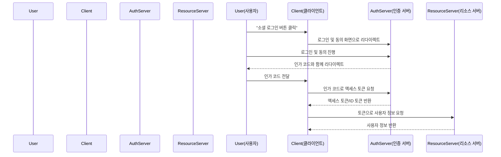

## 금일 목표

- OAuth2 기본 개념 학습
- Spring Security에서 OAuth2 Client 구조 이해
- 구글, 카카오, 네이버 소셜 로그인 실습 준비 
---

## OAuth2 기본 개념 학습

### OAuth2란?

- **OAuth2**는 사용자의 인증 정보를 직접 노출하지 않고, 제3자 애플리케이션이 제한된 접근 권한을 위임받을 수 있도록 해주는 인증/인가 표준 프로토콜

### 인증 플로우

- **Resource Owner**: 리소스 소유자(사용자)
- **Client**: 인증을 요청하는 애플리케이션(내 서비스)
- **Authorization Server**: 인증 및 토큰 발급 서버(구글, 카카오, 네이버 등)
- **Resource Server**: 보호된 API를 제공하는 서버

### OAuth2 장단점 및 유의점

- **장점**
    - **비밀번호 직접 전달 불필요**
        - 사용자의 비밀번호를 서비스에 직접 입력하지 않아 보안성이 높음.
    - **다양한 외부 서비스 연동 용이**
        - 구글, 카카오, 네이버 등 다양한 소셜 플랫폼과 손쉽게 인증 연동 가능.
    - **권한(스코프) 단위 접근 제어**
        - 필요한 범위(scope)만 요청해 세밀한 권한 관리가 가능.
    - **표준 프로토콜**
        - 다양한 언어/플랫폼에서 지원, 확장성과 호환성 우수.

---

- **단점**
    - **구현 복잡성**
        - 다양한 인증 플로우, 토큰 교환, 상태 관리 등으로 구현 난이도가 높음.
    - **보안 취약점 가능성**
        - 잘못된 설정(리디렉트 URI, 토큰 노출 등) 시 CSRF, 토큰 탈취 등 보안 위협 발생 가능.
    - **외부 서비스 의존성**
        - 인증 서버(구글, 카카오 등) 장애나 정책 변경 시 내 서비스에도 영향.
    - **토큰 관리의 어려움**
        - 액세스/리프레시 토큰의 안전한 저장, 만료·폐기 등 추가 관리 필요.
    - **권한 오남용 위험**
        - 과도한 권한 요청 시 사용자 신뢰 저하, 개인정보 침해 우려.

---

- **유의점**
    - **Redirect URI 엄격 관리**
        - 사전 등록된 URI만 허용, 인가 코드 탈취 및 피싱 방지.
    - **HTTPS 필수 사용**
        - 인증, 토큰 교환, API 호출 등 모든 과정에서 HTTPS 적용.
    - **CSRF 방어**
        - state 파라미터 등으로 CSRF 공격 예방.
    - **최소 권한 원칙**
        - 꼭 필요한 scope만 요청해 권한 남용 방지.
    - **토큰 저장 위치 주의**
        - 액세스 토큰은 HTTP Only 쿠키 등 안전한 저장소에 보관.
    - **로그아웃/토큰 폐기 처리**
        - 로그아웃 시 서버·클라이언트에서 토큰 모두 폐기.
    - **외부 서비스 정책 모니터링**
        - 각 소셜 API 정책, 보안 업데이트, 사용 제한 등 지속적 확인 필요.

---

## Spring Security에서 OAuth2 Client 사용법

---

## 대표 회사별(google/kakao/naver) 사용법 

---

## 실습 준비

## 참고 자료

- [OAuth2 공식 문서](https://oauth.net/2/)
- [Curity Auth2 Overview](https://curity.io/resources/learn/oauth-overview/#oauth-20-best-practices)
- [Spring Security 공식 가이드](https://docs.spring.io/spring-security/reference/servlet/oauth2/)
- [Google OAuth2 가이드](https://developers.google.com/identity/protocols/oauth2)
- [Kakao Developers 문서](https://developers.kakao.com/docs/latest/ko/kakaologin/common)
- [Naver Developers 문서](https://developers.naver.com/docs/login/overview/)

---

